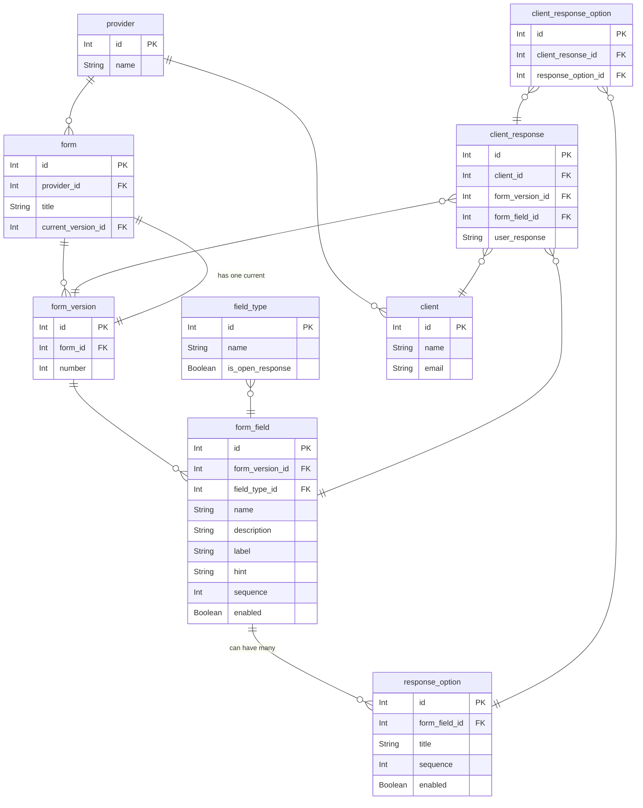

# Database Design
> Generated using [`mermaid`](https://mermaid.js.org/)

- [Database Design](#database-design)
  - [ERD Diagram](#erd-diagram)

## ERD Diagram

```mermaid
erDiagram
"provider" {
  Int id PK
  String name
}
"form" {
  Int id PK
  Int provider_id FK
  String title
  Int current_version_id FK
}
"form_version" {
  Int id PK
  Int form_id FK
  Int number
}
"form_field" {
  Int id PK
  Int form_version_id FK
  Int field_type_id FK
  String name
  String description
  String label
  String hint
  Int sequence
  Boolean enabled
}
"response_option" {
  Int id PK
  Int form_field_id FK
  String title
  Int sequence
  Boolean enabled
}
"field_type" {
  Int id PK
  String name
  Boolean is_open_response
}
"client_response" {
  Int id PK
  Int client_id FK
  Int form_version_id FK
  Int form_field_id FK
  String user_response
}
"client_response_option" {
  Int id PK
  Int client_resonse_id FK
  Int response_option_id FK

}
"client" {
  Int id PK
  String name
  String email
}


"provider" ||--o{ "form" : ""
"form" ||--o{ "form_version" : ""
"form_version" ||--|| "form" : "has one current"
"form_version" ||--o{ "form_field" : ""
"form_field" ||--o{ "response_option" : "can have many"
"field_type" }o--|| "form_field" : ""
"provider" ||--o{ "client" : ""
"client_response" }o--|| "client" : ""
"client_response" }o--|| "form_version" : ""
"client_response" }o--|| "form_field" : ""
"client_response_option" }o--|| "client_response" : ""
"client_response_option" }o--|| "response_option" : ""
```
